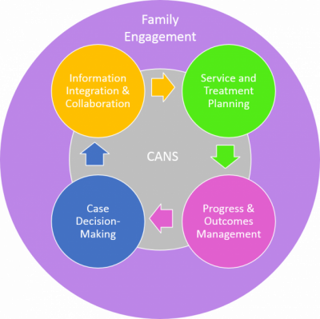
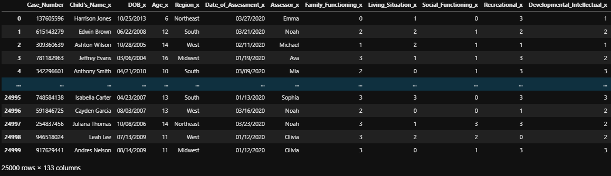
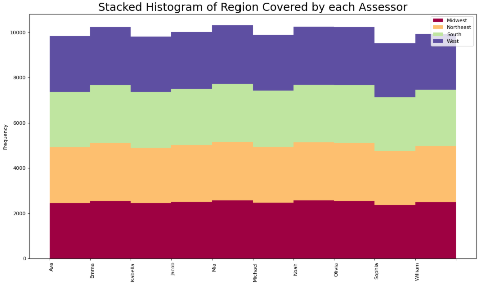
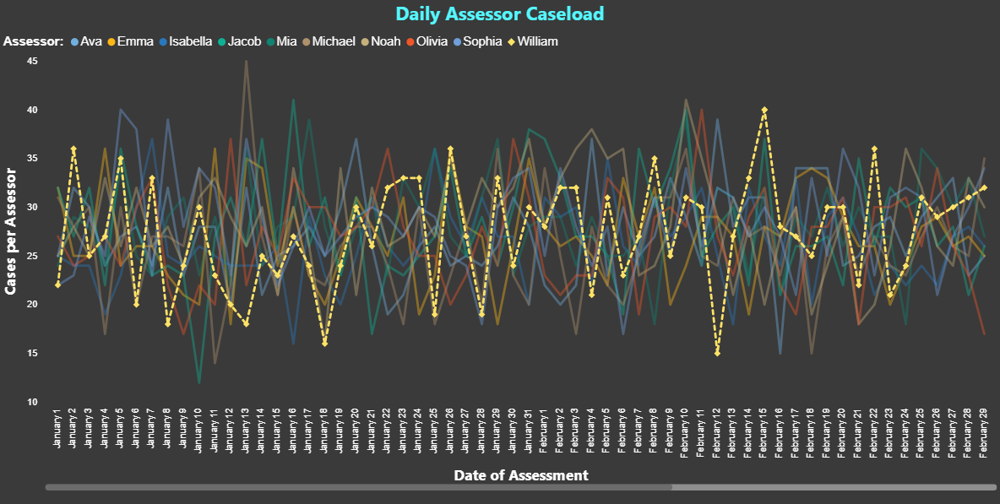
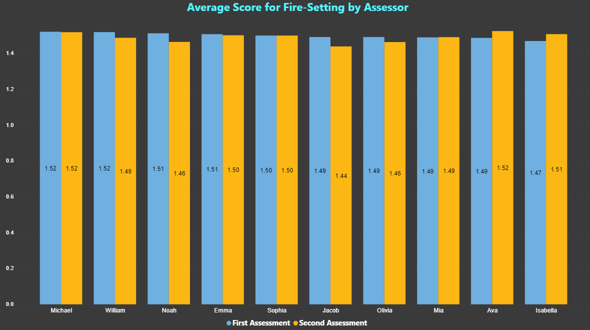
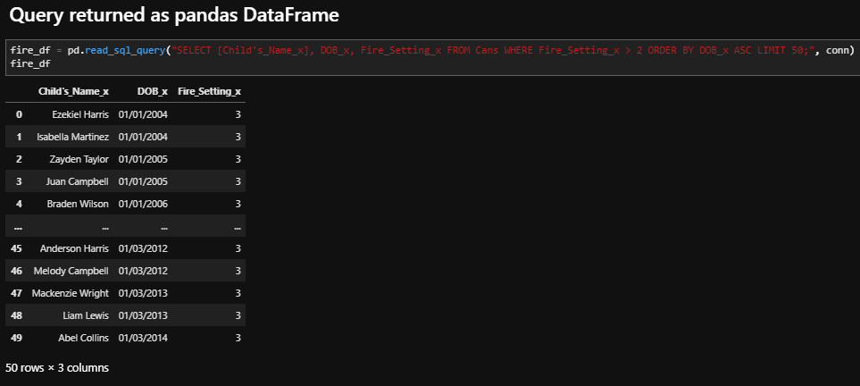
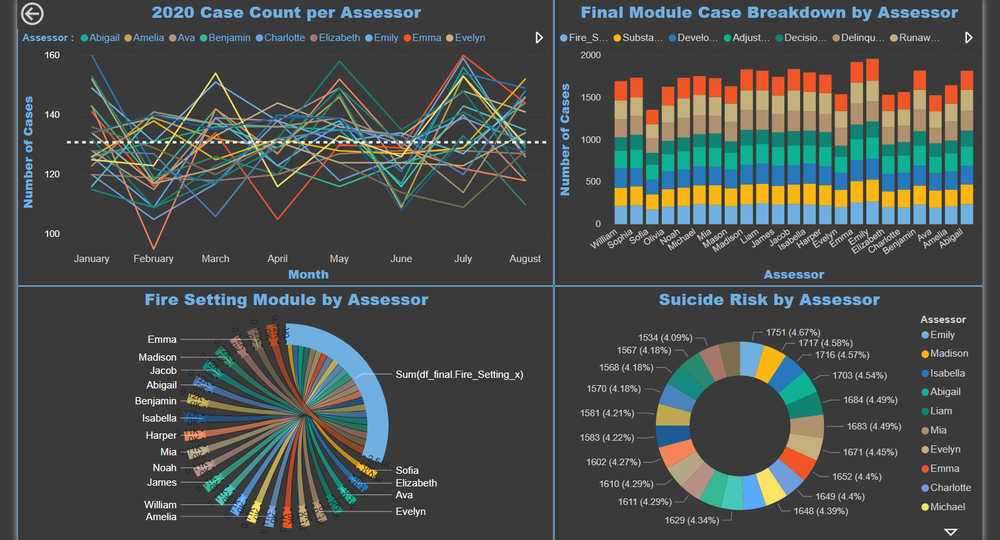

# Data Project for CANS Assessment :children_crossing:
---
## Project Authors: 
* Bryan Lange - [LinkedIn](https://www.linkedin.com/in/bryanrobertlange)
---
### About CANS 
-The Child and Adolescent Needs and Strengths (CANS) is a multi-purpose tool developed for children’s services to support decision making, including level of care and service planning, to facilitate quality improvement initiatives, and to allow for the monitoring of outcomes of services. Versions of the CANS are currently used in 50 states in child welfare, mental health, juvenile justice, and early intervention applications. A comprehensive, multi-system version exists as well. The CANS was developed from a communication perspective so as to facilitate the linkage between the assessment process and the design of individualized service plans including the application of evidence-based practices. The CANS is easy to learn and is well liked by parents, providers and other partners in the services system because it is easy to understand and does not necessarily require scoring in order to be meaningful to an individual child and family. The way the CANS works is that each item suggests different pathways for service planning. There are four levels of each item with anchored definitions; however, these definitions are designed to translate into the following action levels (separate for needs and strengths) from: [Praed Foundation](https://praedfoundation.org/tools/the-child-and-adolescent-needs-and-strengths-cans/)

 

### Project Process 
- In order to replicate the CANS process, I made up a dataset of around 25000 children 
- The intention is to re-create the CANS form found here: [PDF_Link](https://praedfoundation.org/general-forms-cans/)
- Each minor was randomly assigned a birthday and region  

 

 

- The participants were then assigned a caseworker (assessor) to help mimic the real process 

 

- Random scores were created to help simulate actual cases 
- Each participant was given two different assessments, that way any change in behavior could be tracked over time

 

- Trauma Modules were created and minors were added to respective modules and then further assessed with random ratings 

- The data was then connected to a SQLite server for easy queries 

 

- PowerBI was utilized to create a dashboard 

 

